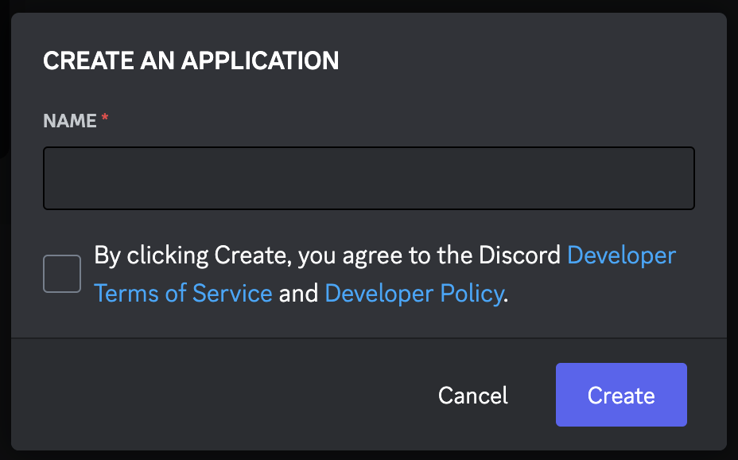
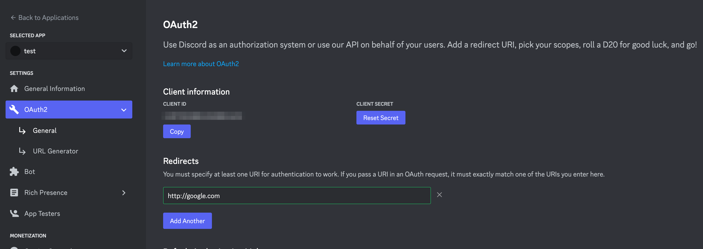
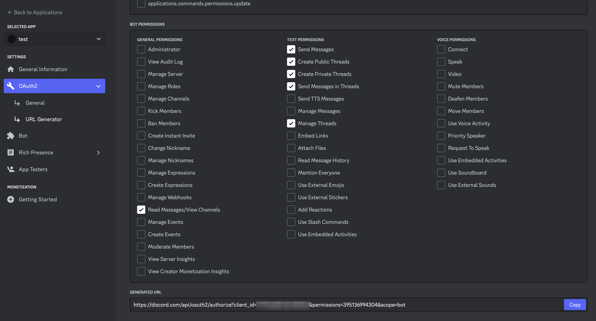
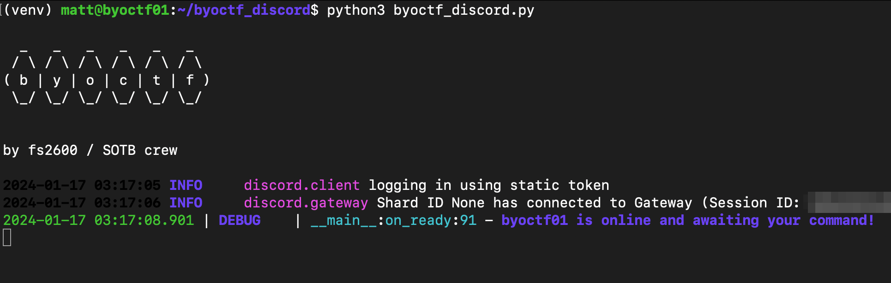

# Web only variant
I've started using uv for project and dependency management. 
https://astral.sh/blog/uv

See my helper aliases for managing virtual envs -> https://gist.github.com/ShyftXero/e2b5c02108ce426e426f872cd3d47cb0

you should be able to get up and running with this.
```
curl -fsSL https://gist.githubusercontent.com/ShyftXero/e2b5c02108ce426e426f872cd3d47cb0/raw/uv_venv.sh >> ~/.zshrc
git clone https://github.com/ShyftXero/byoctf_discord
cd byoctf_discord
uv venv venv --preview --python=3.11
source venv/bin/activate
cp settings_template.py settings.py
cp custom_secrets_template.py custom_secrets.py
uv pip install -r pyproject.toml
./ctrl_ctf.py DEV_RESET # this will populate the db with burner data. 
python scoreboard.py
```
You'll either have to add users manually via `ctrl_ctf.py add_user`, `ctrl_ctf.py bulk_add_user`,  or setup the google oauth thing -> https://medium.com/@miracyuzakli/user-login-and-registration-with-flask-and-google-oauth-2-0-6f5aee1b64ad

see this for the uri_mismatch error -> https://simplyscheduleappointments.com/guides/400-redirect_uri_mismatch-error/


# Discord Setup

Running this software ~~requires~~ used to require a Discord bot. Create one with the following instructions:

- Login to Discord and visit https://discord.com/developers/applications/
- Click "New Application" and give it a name
    
- Provide a redirect URL - for our purposes it can be a dummy URL (e.g. `https://google.com`)
    
- Select appropriate permissions for the default link (optional).
    
- Select bot permissions again on this page and generate an invite URL
    
- Login to Discord and visit the URL to authorize your bot

After creating your bot, create a channel and a role for your CTF.

- Create a channel to be used for your byoctf event. We will collect its ID later on.
- Create a byoctf role. Users will obtain this upon registering for the CTF. Again, we will collect its ID later on.

Now you will need to edit a few files and install some dependencies.

- Edit settings.py
    - Right click in Discord to get these.
    ```bash
    "_ctf_guild_id": "" # Target Discord server
    "_ctf_channel_id": "" # Channel given to users after registration
    "_ctf_channel_role_id": "" # Role giver to users after registration
    ```
- `sudo su`
- `cd /root`
- `git clone https://github.com/ShyftXero/byoctf_discord`
- `cd byoctf_discord`
- Add Discord bot token - take necessary precautions
    - `echo "DISCORD_TOKEN='asdfasdfasdf'" > custom_secrets.py`
- Use rye to install dependencies (https://rye-up.com/guide/)
    - `sudo su`
    - `cd  /root/byoctf_discord/`
    - `python3 -m venv .venv`
    - `pip install -r requirements.lock`
- Create `settings.py`
    - `cp settings_template.py settings.py`
- Edit `settings.py`
    ```bash
    "_ctf_guild_id": 1023627643804975135, # your discord server. user right-click copy ID to get these

    "_ctf_channel_id": 1196678103167139963, # channel ID to give to users once they register.

    "_ctf_channel_role_id": 1196678315092746260, # the ID of the role which will be given to players as they register; makes the channel visible to them.
    ```

- Create the DB and fill with test data: `python3 ctrl_ctf.py DEV_RESET`
- Or for no test data: `python3 ctrl_ctf.py INIT`
- Note: You must repeat the `INIT` command above after making changes to `settings.py`
- Run it! `python byoctf_discord.py`

- Make sure to send your commands via a direct message to the bot. Avoid public channels. Here are some good initial commands to test out and confirm your setup.
    - `!help`
    - `!reg TEAM TEAMPASS`
    
