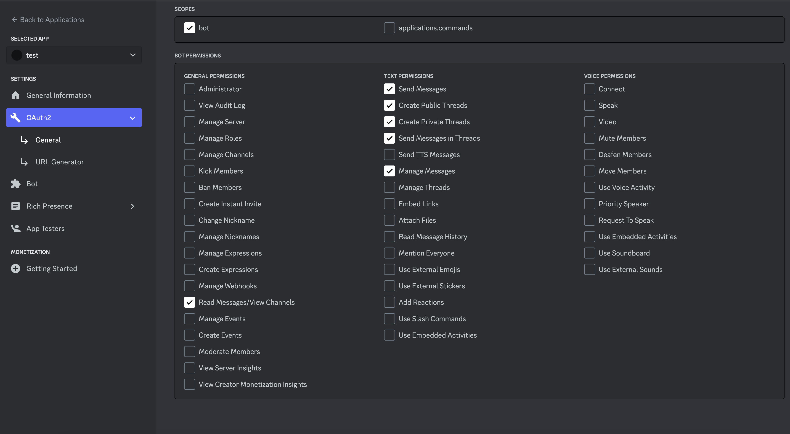

# Setup

Running this software requires a Discord bot. Create one before proceeding.

- Visit `https://discord.com/developers/applications/`
- Click "New Application" and give it a name
    
- Provide a redirect URL - for our purposes it can be a dummy URL (e.g. `https://google.com`)
    
- Select appropriate permissions.
    
- Select bot permissions again on this page and generate a URL
    
- Login to Discord and visit the URL to authorize your bot
- Create a channel to be used for your byoctf event. We will collect its ID later on.
- Create a byoctf role. Users will obtain this upon registering. Again, we will collect its ID later on.
- Edit settings.py
    - Right click in Discord to get these.
    ```bash
    "_ctf_guild_id": "" # Target Discord server
    "_ctf_channel_id": "" # Channel given to users after registration
    "_ctf_channel_role_id": "" # Role giver to users after registration
    ```
- `git clone https://github.com/ShyftXero/byoctf_discord`
- `cd byoctf_discord`
- Add Discord bot token - take necessary precautions
    - `echo "DISCORD_TOKEN='asdfasdfasdf'" > custom_secrets.py`
- Use rye to install dependencies (https://rye-up.com/guide/)
	- `curl -sSf https://rye-up.com/get | bash`
	- `source "$HOME/.rye/env"`
	- `rye sync`

- Edit `settings.py`
    ```bash
    "_ctf_guild_id": 1023627643804975135, # your discord server. user right-click copy ID to get these

    "_ctf_channel_id": 1196678103167139963, # channel ID to give to users once they register.

    "_ctf_channel_role_id": 1196678315092746260, # the ID of the role which will be given to players as they register; makes the channel visible to them.
    ```

- Create the DB and fill with test data: `python3 ctrl_ctf.py DEV_RESET`
- Or for no test data: `python3 ctrl_ctf.py INIT`
- Note: You must repeat the `INIT` command above after making changes to `settings.py`
- Run it! `python byoctf_discord.py`

- Make sure to direct message bot to interact with it. Avoid public channels. Here are some good initial commands to test things out:
    - `!help`
    - `!reg TEAM TEAMPASS`
    